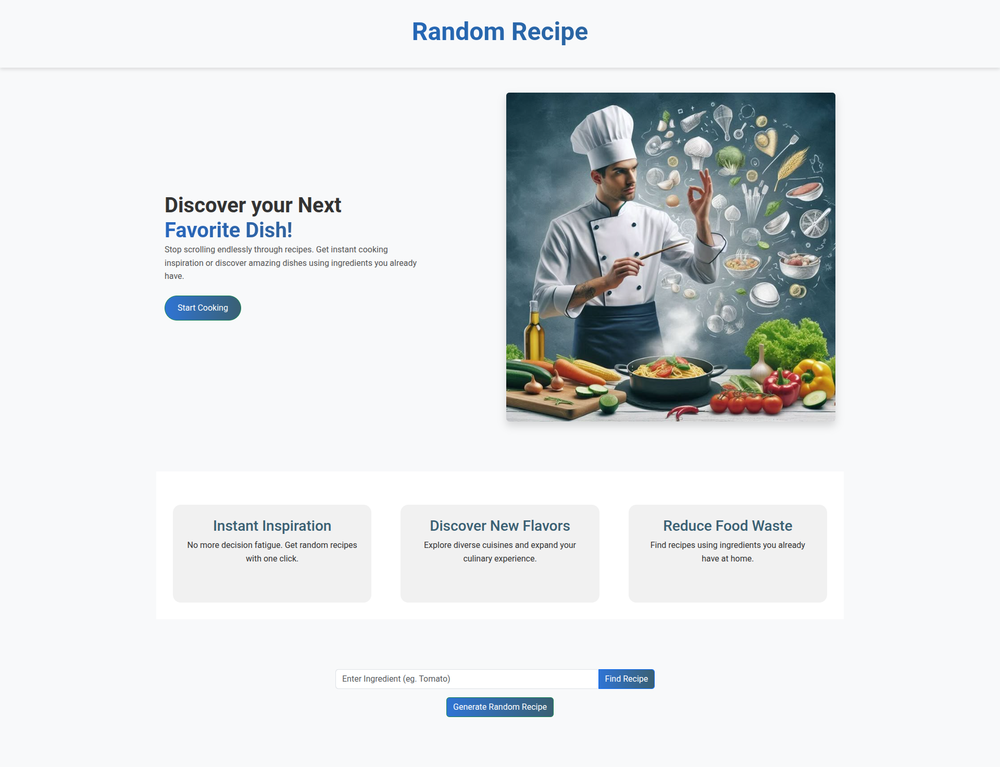

# 🍴 Recipe Finder

The **Random Recipe Generator** is a simple web application that fetches and displays random meal recipes using [TheMealDB API](https://www.themealdb.com/).  
It allows users to discover new dishes with ingredients, instructions, and meal images in just one click.

---

## 🚀 Features
- Generate a **random recipe** instantly.
- Search for recipes by **name** or **Ingredients**.
- View recipe details including:
  - Meal name
  - Meal image
  - Ingredients & measurements
  - Cooking instructions
- Responsive design for desktop and mobile.

---

## 🛠️ Tech Stack
- **HTML5** – Structure
- **CSS3** / **Bootstrap** – Styling & responsiveness
- **JavaScript (ES6)** – Core functionality
- **TheMealDB API** – Recipe data source

---

## 📦 Installation

1. Clone the repository:
  ```bash
  git clone https://github.com/Hillary90/Recipe-Finder.git
  ```
2. Navigate to the project folder:
  ```
  cd Recipe-Finder/
  ```
3. Open index.html right click then select Open With Live Server to open in your browser.

# 📖 Usage
1. Generate a Random Recipe

Click the "Generate Recipe" button to fetch and display a random recipe with:

- Meal name
- Ingredients & measurements
- Instructions
- Category & cuisine

# Fetch Random Recipe.

Example API call:
```js

const API_URL = "https://www.themealdb.com/api/json/v1/1/";

async function fetchRandomRecipe() {
  try {
    const response = await fetch(`${API_URL}random.php`);
    const data = await response.json();
    displayRecipe(data.meals[0]);
  } catch (error) {
    console.error("Error fetching random recipe:", error);
  }
}
```
# 📸 Screenshots
Home Page


# Live Demo
You can view the project here: [Live Site](https://hillary90.github.io/Recipe-Finder/)

# 🔑 API Reference

This project uses the free TheMealDB API.

Endpoints used:
[TheMealDB API](https://www.themealdb.com/)


# 🎯 Roadmap 

- 🔍 Search by ingredients or cuisines
- ⭐ Save favorite recipes (local storage)


# 🤝 Contributing

Contributions, issues, and feature requests are welcome!
Feel free to check out the issues page.

# 📜 License

This project is licensed under the MIT License– see the [LICENSE](LICENSE.md) file.
 file for details.

# 🙌 Acknowledgements

- TheMealDB
  for providing the free recipes API.
- Bootstrap for UI components.

# ✨ Happy Cooking! ✨